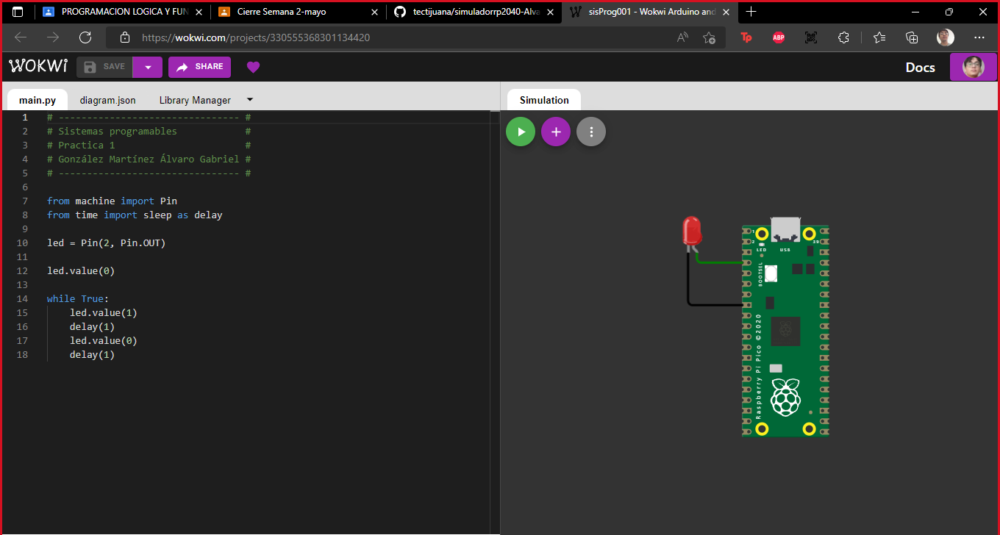

## sisProg001
### Simulación de conexión de un led con raspberry pico

Por: [González Martínez Álvaro Gabriel](github.com/alvaroggm123)
### [Loom de referencia](https://www.loom.com/share/180bfb775de7448ba3eb8e2390ed29f6)
<pre>

<iframe src="https://www.loom.com/embed/180bfb775de7448ba3eb8e2390ed29f6" frameborder="0" webkitallowfullscreen mozallowfullscreen allowfullscreen style="position: absolute; top: 0; left: 0; width: 100%; height: 100%;"></iframe>

</pre>

## Imagen del código y circuito implementado.

